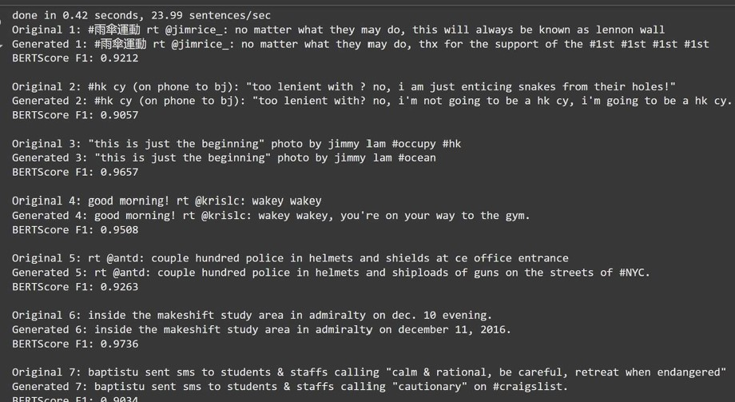
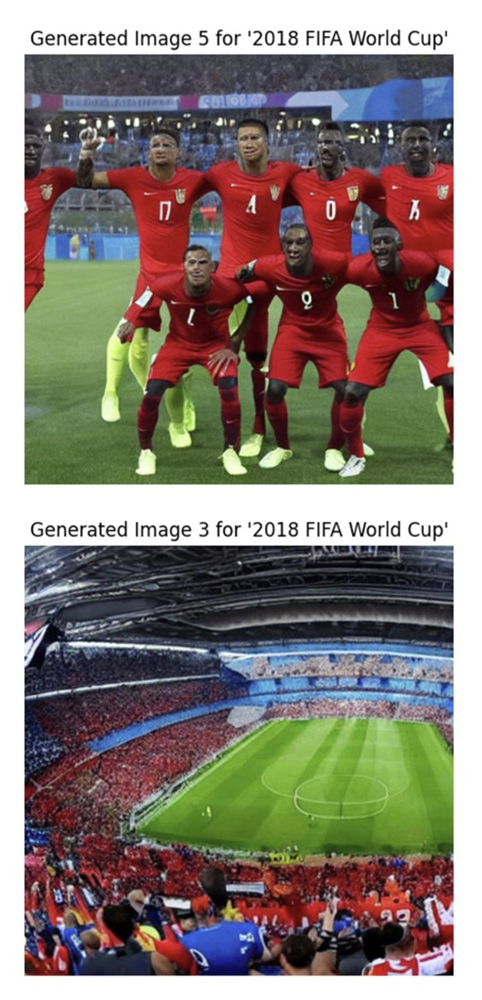

# Multi-Modal Event Detection System

## Overview
This project develops a **multi-modal deep learning system** to detect events from news articles and associated images. Using text and image features, the system identifies and classifies events, leveraging generative AI techniques to augment datasets for improved performance. The project integrates **GPT-2** for text generation and **Stable Diffusion** for image synthesis, enhancing the robustness and accuracy of event detection.

---

## Features
- **Multi-Modal Event Detection**:
  - Processes text and images for comprehensive event analysis.
  - Utilizes pre-trained models like BERT and VGG for feature extraction.
- **Generative Data Augmentation**:
  - Text augmentation with GPT-2.
  - Image synthesis using Stable Diffusion.
- **Data Insights**:
  - Exploratory data analysis (EDA) reveals trends, class imbalances, and optimal dataset configurations.
- **Visualization Tools**:
  - Word clouds for text analysis.
  - Confusion matrices for model performance evaluation.
  - Event-specific generated image displays.

---

## Dataset
- **Source**: NED Dataset (17,366 posts tagged with 40 real-world events and associated images).
- **Event Types**: Includes natural disasters, sporting events, and political events.
- **Key Attributes**:
  - News text and associated images.
  - Class labels for event types.

---

## Methodology
1. **Data Preprocessing**:
   - Text cleaning: Removed HTML tags, special characters, emojis, and stopwords.
   - Image validation: Ensured every record includes valid images.
   - Focused on top 5 event classes to optimize GPU and memory usage.
2. **Feature Extraction**:
   - **Text**: BERT and DistilBERT for semantic embeddings.
   - **Images**: VGG, MobileNet, and SqueezeNet for visual features.
3. **Generative Augmentation**:
   - **GPT-2**: Generated synthetic text to enrich underrepresented classes.
   - **Stable Diffusion**: Created synthetic event-specific images.
4. **Multi-Modal Integration**:
   - Combined text and image features into a unified representation.
   - Fully connected layers processed the integrated features for classification.
5. **Model Training**:
   - Fine-tuned on real and synthetic datasets.
   - Evaluated using metrics like accuracy, precision, recall, and F1-score.

---

## Results
- **Performance**:
  - Improved detection rates for rare events due to augmented data.
  - Accuracy for synthetic image classification: **79%**.
- **Visualization**:
  - Confusion matrices highlighted areas for improvement.
  - Word clouds visualized prominent terms for events.

---

## Implementation
### Requirements
- **Programming Language**: Python
- **Frameworks/Libraries**:
  - Transformers (BERT, GPT-2)
  - TensorFlow/PyTorch
  - Stable Diffusion
  - Matplotlib and Seaborn for visualizations

### Setup
1. Clone the repository:
   ```bash
   git clone https://github.com/your-repo/multimodal-event-detection.git
   ```
2. Install dependencies:
   ```bash
   pip install -r requirements.txt
   ```
3. Run preprocessing and model training scripts:
   ```bash
   python preprocess.py
   python train_model.py
   ```

---

## Visualization
- **Word Cloud**:
  
- **Data Augmentation**:
  
  
